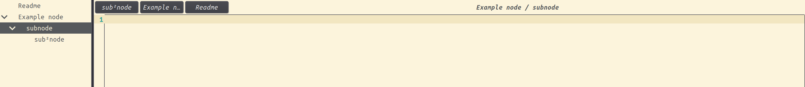

# CherryTree-LightTheme

## Table of Contents

<!-- TOC -->
* [CherryTree-LightTheme](#cherrytree-lighttheme)
  * [Table of Contents](#table-of-contents)
  * [Screenshots](#screenshots)
    * [Theme example](#theme-example)
    * [Color palette](#color-palette)
    * [Tree visualization](#tree-visualization)
  * [Installation](#installation)
  * [Usefull Link](#usefull-link)
<!-- TOC -->

## Screenshots

### Theme example

### Color palette

### Tree visualization

## Installation

1. Open CherryTree
2. File -> Preferences -> Import Preferences
3. Select violet_light.cfg & Restart CherryTree

## Usefull Link

-> [CherryTree Repository](https://github.com/giuspen/cherrytree)